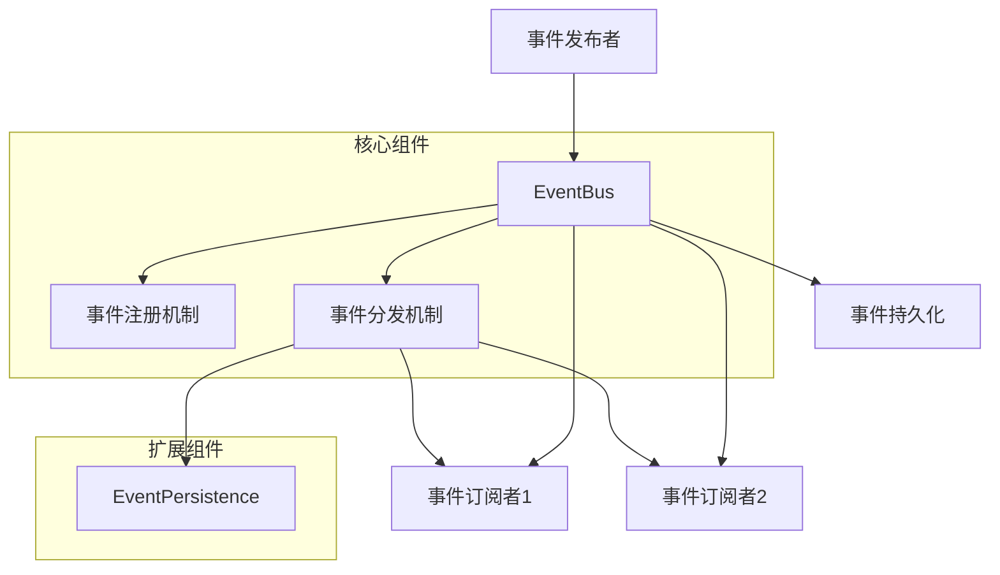

# Atlas事件驱动框架开发者指南

## 1. 概述

Atlas事件驱动框架是一个基于Java注解的轻量级事件驱动框架，专为Spring Boot应用设计。该框架实现了发布/订阅模式，支持同步和异步事件处理、事件持久化以及灵活的配置选项。

### 1.1 核心特性

- 基于注解的事件发布和订阅机制
- 支持同步和异步事件处理
- 可扩展的事件持久化机制
- 与Spring Boot无缝集成
- 灵活的配置选项

### 1.2 模块结构

```
atlas-event/
├── atlas-event-core/                  # 核心模块，包含事件总线、事件接口等核心组件
├── atlas-event-spring-boot-starter/   # Spring Boot Starter模块，提供自动配置功能
└── atlas-event-sample/                # 示例应用模块，展示框架使用方法
```

## 2. 技术栈与依赖

- Java 8+
- Spring 5.2+
- Spring Boot 2.2+
- Maven 3.6+

## 3. 核心组件架构

### 3.1 组件定义

| 组件 | 描述 |
|------|------|
| [EventBus](file:///Users/nemoob/dev/workspace/qoder/atlas/atlas-event/atlas-event-core/src/main/java/io/github/nemoob/event/core/EventBus.java#L6-L22) | 事件总线接口，负责事件的发布和订阅管理 |
| [DefaultEventBus](file:///Users/nemoob/dev/workspace/qoder/atlas/atlas-event/atlas-event-core/src/main/java/io/github/nemoob/event/core/DefaultEventBus.java#L12-L112) | EventBus的默认实现 |
| [Event](file:///Users/nemoob/dev/workspace/qoder/atlas/atlas-event/atlas-event-core/src/main/java/io/github/nemoob/event/core/Event.java#L8-L25) | 事件接口，定义事件的基本结构 |
| [@EventPublish](file:///Users/nemoob/dev/workspace/qoder/atlas/atlas-event/atlas-event-core/src/main/java/io/github/nemoob/event/annotation/EventPublish.java#L11-L25) | 注解，标识事件发布者类 |
| [@EventSubscribe](file:///Users/nemoob/dev/workspace/qoder/atlas/atlas-event/atlas-event-core/src/main/java/io/github/nemoob/event/annotation/EventSubscribe.java#L10-L24) | 注解，标识事件消费者方法 |
| [EventPersistence](file:///Users/nemoob/dev/workspace/qoder/atlas/atlas-event/atlas-event-core/src/main/java/io/github/nemoob/event/persistence/EventPersistence.java#L9-L22) | 事件持久化接口 |
| [DatabaseEventPersistence](file:///Users/nemoob/dev/workspace/qoder/atlas/atlas-event/atlas-event-core/src/main/java/io/github/nemoob/event/persistence/DatabaseEventPersistence.java#L8-L32) | EventPersistence的数据库实现示例 |

### 3.2 架构图



## 4. 使用指南

### 4.1 添加依赖

在项目的`pom.xml`中添加以下依赖：

```xml
<dependency>
    <groupId>io.github.nemoob</groupId>
    <artifactId>atlas-event-spring-boot-starter</artifactId>
    <version>1.0.0</version>
</dependency>
```

### 4.2 发布事件

1. 创建事件类，实现[Event](file:///Users/nemoob/dev/workspace/qoder/atlas/atlas-event/atlas-event-core/src/main/java/io/github/nemoob/event/core/Event.java#L8-L25)接口：

```java
public class UserRegisteredEvent implements Event {
    private final String id;
    private final String username;
    private final long timestamp;
    private final Map<String, Object> metadata;
    
    public UserRegisteredEvent(String id, String username) {
        this.id = id;
        this.username = username;
        this.timestamp = System.currentTimeMillis();
        this.metadata = new HashMap<>();
    }
    
    @Override
    public String getId() {
        return id;
    }
    
    @Override
    public String getType() {
        return "user.registered";
    }
    
    @Override
    public Object getData() {
        Map<String, Object> data = new HashMap<>();
        data.put("username", username);
        return data;
    }
    
    @Override
    public long getTimestamp() {
        return timestamp;
    }
    
    @Override
    public Map<String, Object> getMetadata() {
        return metadata;
    }
    
    public String getUsername() {
        return username;
    }
}
```

2. 在需要发布事件的服务类上添加[@EventPublish](file:///Users/nemoob/dev/workspace/qoder/atlas/atlas-event/atlas-event-core/src/main/java/io/github/nemoob/event/annotation/EventPublish.java#L11-L25)注解，并注入[EventBus](file:///Users/nemoob/dev/workspace/qoder/atlas/atlas-event/atlas-event-core/src/main/java/io/github/nemoob/event/core/EventBus.java#L6-L22)：

```java
@Service
@EventPublish
public class UserService {
    
    private final EventBus eventBus;
    
    public UserService(EventBus eventBus) {
        this.eventBus = eventBus;
    }
    
    public void registerUser(String username) {
        // 用户注册逻辑
        // ...
        
        // 发布事件
        UserRegisteredEvent event = new UserRegisteredEvent(UUID.randomUUID().toString(), username);
        eventBus.publish(event);
    }
}
```

### 4.3 订阅事件

在需要处理事件的服务类方法上添加[@EventSubscribe](file:///Users/nemoob/dev/workspace/qoder/atlas/atlas-event/atlas-event-core/src/main/java/io/github/nemoob/event/annotation/EventSubscribe.java#L10-L24)注解：

```java
@Service
public class NotificationService {
    
    @EventSubscribe(eventType = "user.registered")
    public void onUserRegistered(UserRegisteredEvent event) {
        // 处理用户注册事件
        System.out.println("User registered: " + event.getUsername());
    }
    
    // 异步处理事件
    @EventSubscribe(eventType = "user.registered", async = true)
    public void onUserRegisteredAsync(UserRegisteredEvent event) {
        // 异步处理用户注册事件
        System.out.println("Async handling user registered: " + event.getUsername());
    }
}
```

### 4.4 配置选项

在`application.yml`中配置事件框架选项：

```yaml
atlas:
  event:
    thread-pool-size: 10        # 线程池大小
    persistence-type: database   # 持久化类型
    enable-async: true          # 是否启用异步处理
    max-retry-attempts: 3       # 最大重试次数
```

## 5. 高级功能

### 5.1 事件持久化

框架提供了事件持久化接口，可以将事件持久化到存储系统中。

1. 实现[EventPersistence](file:///Users/nemoob/dev/workspace/qoder/atlas/atlas-event/atlas-event-core/src/main/java/io/github/nemoob/event/persistence/EventPersistence.java#L9-L22)接口：

```java
public class DatabaseEventPersistence implements EventPersistence {
    
    @Override
    public void save(Event event) {
        // 实现事件保存逻辑
        System.out.println("Saving event to database: " + event.getId());
    }
    
    @Override
    public List<Event> findByType(String eventType, int limit) {
        // 实现根据事件类型查询事件逻辑
        System.out.println("Finding events by type: " + eventType);
        return Collections.emptyList();
    }
    
    @Override
    public Event findById(String id) {
        // 实现根据事件ID查询事件逻辑
        System.out.println("Finding event by id: " + id);
        return null;
    }
}
```

2. 在配置类中注册持久化实现：

```java
@Configuration
public class EventPersistenceConfiguration {
    
    @Bean
    public EventPersistence eventPersistence() {
        return new DatabaseEventPersistence();
    }
}
```

### 5.2 异步事件处理

通过在[@EventSubscribe](file:///Users/nemoob/dev/workspace/qoder/atlas/atlas-event/atlas-event-core/src/main/java/io/github/nemoob/event/annotation/EventSubscribe.java#L10-L24)注解中设置`async = true`来启用异步事件处理：

```java
@EventSubscribe(eventType = "user.registered", async = true)
public void onUserRegisteredAsync(UserRegisteredEvent event) {
    // 异步处理逻辑
}
```

## 6. 最佳实践

### 6.1 事件设计原则

1. **事件命名**：使用名词短语，采用"对象.动作"的格式，如"user.registered"
2. **事件数据**：事件应该包含足够的信息供订阅者使用，但不要包含敏感信息
3. **事件不可变性**：事件一旦创建就不应该被修改
4. **事件版本控制**：当事件结构发生变化时，考虑版本控制

### 6.2 性能优化

1. **合理使用异步处理**：对于耗时操作，使用异步处理避免阻塞主线程
2. **线程池配置**：根据业务需求合理配置线程池大小
3. **事件过滤**：对于不需要处理的事件，尽早过滤掉

### 6.3 错误处理

1. **异常捕获**：在事件处理方法中捕获并处理异常
2. **重试机制**：对于重要的事件处理，实现重试机制
3. **监控和日志**：记录事件处理的日志，便于问题排查

## 7. 扩展机制

### 7.1 自定义EventBus

可以通过实现[EventBus](file:///Users/nemoob/dev/workspace/qoder/atlas/atlas-event/atlas-event-core/src/main/java/io/github/nemoob/event/core/EventBus.java#L6-L22)接口来创建自定义的事件总线：

```java
public class CustomEventBus implements EventBus {
    // 事件类型与监听器方法的映射
    private final Map<String, List<EventListener>> listeners = new ConcurrentHashMap<>();
    
    @Override
    public void publish(Event event) {
        String eventType = event.getType();
        List<EventListener> eventListeners = listeners.get(eventType);
        
        if (eventListeners != null) {
            for (EventListener listener : eventListeners) {
                if (listener.isAsync()) {
                    // 异步处理
                    new Thread(() -> invokeListener(listener, event)).start();
                } else {
                    // 同步处理
                    invokeListener(listener, event);
                }
            }
        }
    }
    
    @Override
    public void register(Object listener) {
        scanAndRegister(listener);
    }
    
    @Override
    public void unregister(Object listener) {
        // 实现注销逻辑
    }
    
    @Override
    public void scanAndRegister(Object listener) {
        Class<?> listenerClass = listener.getClass();
        Method[] methods = ReflectionUtils.getAllDeclaredMethods(listenerClass);
        
        for (Method method : methods) {
            if (method.isAnnotationPresent(EventSubscribe.class)) {
                EventSubscribe annotation = method.getAnnotation(EventSubscribe.class);
                String eventType = annotation.eventType();
                
                // 如果没有指定事件类型，则使用参数类型
                if (eventType.isEmpty() && method.getParameterTypes().length > 0) {
                    eventType = method.getParameterTypes()[0].getName();
                }
                
                if (!eventType.isEmpty()) {
                    EventListener eventListener = new EventListener(listener, method, annotation.async(), annotation.threadPool());
                    listeners.computeIfAbsent(eventType, k -> new CopyOnWriteArrayList<>()).add(eventListener);
                }
            }
        }
    }
    
    private void invokeListener(EventListener listener, Event event) {
        try {
            listener.getMethod().invoke(listener.getTarget(), event);
        } catch (Exception e) {
            // 记录异常日志
            e.printStackTrace();
        }
    }
    
    /**
     * 事件监听器内部类
     */
    private static class EventListener {
        private final Object target;
        private final Method method;
        private final boolean async;
        private final String threadPool;
        
        public EventListener(Object target, Method method, boolean async, String threadPool) {
            this.target = target;
            this.method = method;
            this.async = async;
            this.threadPool = threadPool;
        }
        
        // getter方法
        public Object getTarget() { return target; }
        public Method getMethod() { return method; }
        public boolean isAsync() { return async; }
        public String getThreadPool() { return threadPool; }
    }
}
```

然后在配置类中注册：

```java
@Configuration
public class EventConfiguration {
    
    @Bean
    public EventBus eventBus() {
        return new CustomEventBus();
    }
}
```

### 7.2 自定义注解处理器

可以通过扩展[EventAnnotationProcessor](file:///Users/nemoob/dev/workspace/qoder/atlas/atlas-event/atlas-event-spring-boot-starter/src/main/java/io/github/nemoob/event/processor/EventAnnotationProcessor.java#L13-L57)来自定义注解处理逻辑：

```java
@Component
public class CustomEventAnnotationProcessor extends EventAnnotationProcessor {
    
    public CustomEventAnnotationProcessor(EventBus eventBus) {
        super(eventBus);
    }
    
    @Override
    public Object postProcessBeforeInitialization(Object bean, String beanName) throws BeansException {
        // 添加自定义处理逻辑
        System.out.println("Processing bean: " + beanName);
        
        // 调用父类方法
        return super.postProcessBeforeInitialization(bean, beanName);
    }
}
```

## 8. 测试策略

### 8.1 单元测试

使用JUnit和Mockito对事件处理逻辑进行单元测试：

```java
@ExtendWith(MockitoExtension.class)
public class NotificationServiceTest {
    
    @Mock
    private EventBus eventBus;
    
    @InjectMocks
    private NotificationService notificationService;
    
    @Test
    public void testUserRegistrationEvent() {
        // 准备测试数据
        UserRegisteredEvent event = new UserRegisteredEvent("1", "testuser");
        
        // 执行测试
        notificationService.onUserRegistered(event);
        
        // 验证结果
        // 验证控制台输出或其他业务逻辑
    }
    
    @Test
    public void testAsyncUserRegistrationEvent() {
        // 准备测试数据
        UserRegisteredEvent event = new UserRegisteredEvent("1", "testuser");
        
        // 执行测试
        notificationService.onUserRegisteredAsync(event);
        
        // 验证结果
        // 验证异步处理逻辑
    }
}
```

### 8.2 集成测试

使用Spring Boot Test进行集成测试，验证事件发布和订阅的完整流程：

```java
@SpringBootTest
public class EventIntegrationTest {
    
    @Autowired
    private UserService userService;
    
    @SpyBean
    private NotificationService notificationService;
    
    @Test
    public void testEventPublishAndSubscribe() {
        // 执行用户注册，触发事件发布
        userService.registerUser("JohnDoe");
        
        // 验证通知服务被调用
        verify(notificationService, timeout(1000)).onUserRegistered(any(UserRegisteredEvent.class));
        verify(notificationService, timeout(1000)).onUserRegisteredAsync(any(UserRegisteredEvent.class));
    }
}
```

## 9. 故障排除

### 9.1 事件未被处理

1. 检查订阅方法上是否正确添加了[@EventSubscribe](file:///Users/nemoob/dev/workspace/qoder/atlas/atlas-event/atlas-event-core/src/main/java/io/github/nemoob/event/annotation/EventSubscribe.java#L10-L24)注解
2. 检查事件类型是否匹配
3. 确认订阅者对象已被正确注册到[EventBus](file:///Users/nemoob/dev/workspace/qoder/atlas/atlas-event/atlas-event-core/src/main/java/io/github/nemoob/event/core/EventBus.java#L6-L22)
4. 检查是否在Spring容器中正确配置了组件扫描

### 9.2 异步处理问题

1. 检查线程池配置是否正确
2. 查看异步处理方法中的异常日志
3. 确认异步处理方法是否正确标记为`async = true`
4. 检查是否在配置中启用了异步处理功能

### 9.3 事件持久化问题

1. 检查是否正确实现了[EventPersistence](file:///Users/nemoob/dev/workspace/qoder/atlas/atlas-event/atlas-event-core/src/main/java/io/github/nemoob/event/persistence/EventPersistence.java#L9-L22)接口
2. 确认持久化Bean是否被正确注册到Spring容器
3. 检查数据库连接配置是否正确
4. 验证持久化方法中的异常处理逻辑

## 10. API参考

### 10.1 EventBus接口

| 方法 | 描述 |
|------|------|
| void publish([Event](file:///Users/nemoob/dev/workspace/qoder/atlas/atlas-event/atlas-event-core/src/main/java/io/github/nemoob/event/core/Event.java#L8-L25) event) | 发布事件 |
| void register(Object listener) | 注册事件监听器 |
| void unregister(Object listener) | 注销事件监听器 |
| void scanAndRegister(Object listener) | 扫描并注册监听器 |

### 10.2 Event接口

| 方法 | 描述 |
|------|------|
| String getId() | 获取事件ID |
| String getType() | 获取事件类型 |
| Object getData() | 获取事件数据 |
| long getTimestamp() | 获取事件时间戳 |
| Map<String, Object> getMetadata() | 获取事件元数据 |

### 10.3 注解

#### @EventPublish

| 属性 | 类型 | 默认值 | 描述 |
|------|------|--------|------|
| enable | boolean | true | 是否启用事件发布 |
| eventTypes | String[] | {} | 事件类型数组 |
| persist | boolean | false | 是否持久化 |
| persistFilter | String | "" | 持久化过滤器 |

#### @EventSubscribe

| 属性 | 类型 | 默认值 | 描述 |
|------|------|--------|------|
| eventType | String | "" | 事件类型 |
| eventClass | Class<? extends [Event](file:///Users/nemoob/dev/workspace/qoder/atlas/atlas-event/atlas-event-core/src/main/java/io/github/nemoob/event/core/Event.java#L8-L25)> | [Event](file:///Users/nemoob/dev/workspace/qoder/atlas/atlas-event/atlas-event-core/src/main/java/io/github/nemoob/event/core/Event.java#L8-L25).class | 事件类 |
| async | boolean | false | 是否异步处理 |
| threadPool | String | "" | 线程池名称 |