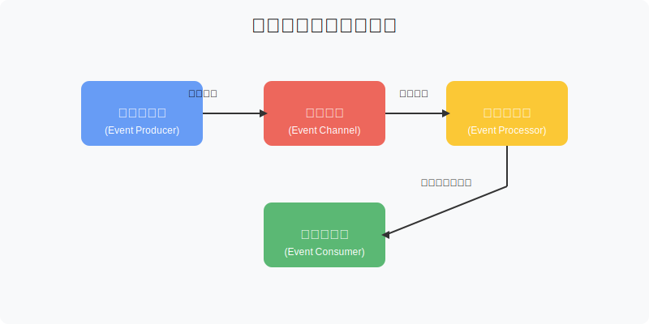
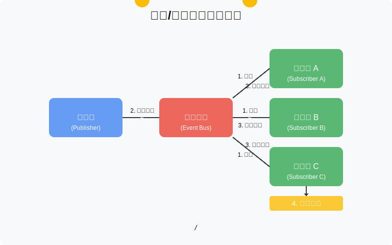
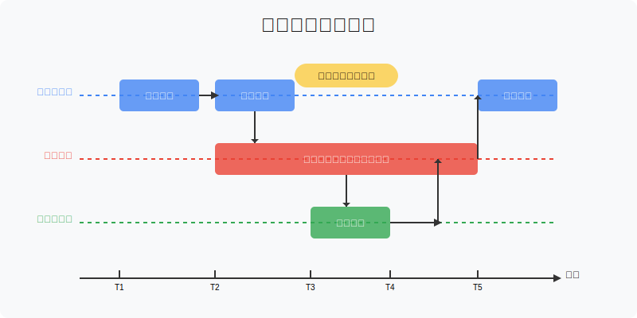
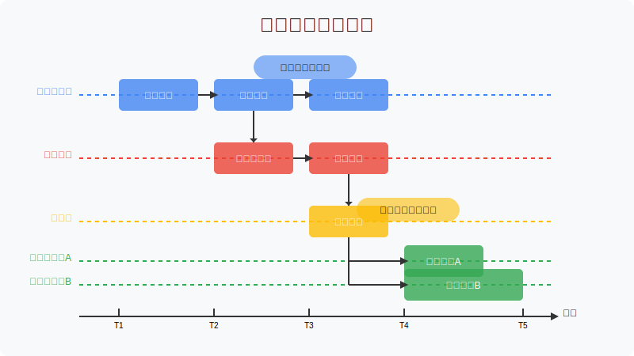
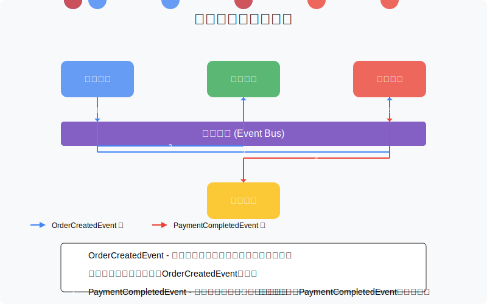

# 第1章：事件驱动框架基础概念

## 1.1 什么是事件驱动架构

事件驱动架构（Event-Driven Architecture，简称EDA）是一种软件架构模式，它基于事件的生产、检测、消费和响应。在这种架构中，当系统中发生某些重要变化或状态转换时，会产生事件，而其他组件可以对这些事件做出响应，而无需了解事件的来源。

### 事件的定义

事件是系统中发生的一个值得注意的状态变化。例如：

- 用户注册成功
- 订单创建完成
- 支付处理完毕
- 库存数量变更

每个事件通常包含以下信息：

- **事件ID**：唯一标识符
- **事件类型**：描述事件的性质
- **事件数据**：与事件相关的具体信息
- **时间戳**：事件发生的时间
- **元数据**：其他辅助信息

### 事件驱动架构的核心组件



事件驱动架构通常包含以下核心组件：

1. **事件生产者（Event Producer）**：负责检测状态变化并生成事件
2. **事件通道（Event Channel）**：传输事件的媒介，可以是消息队列、事件总线等
3. **事件处理器（Event Processor）**：接收并处理事件的组件
4. **事件消费者（Event Consumer）**：对事件做出响应的组件

## 1.2 发布/订阅模式详解

发布/订阅（Publish/Subscribe，简称Pub/Sub）模式是实现事件驱动架构的一种常见方式。在这种模式中：

- **发布者（Publisher）**：生成事件并发布到事件通道
- **订阅者（Subscriber）**：从事件通道接收感兴趣的事件并处理
- **事件总线（Event Bus）**：连接发布者和订阅者的中间件

### 发布/订阅模式的工作流程



1. 订阅者向事件总线注册，表明对特定类型事件的兴趣
2. 发布者将事件发送到事件总线
3. 事件总线将事件路由到对该类型事件感兴趣的所有订阅者
4. 订阅者接收并处理事件

### 发布/订阅模式的特点

- **松耦合**：发布者不需要知道谁在订阅事件，订阅者不需要知道谁在发布事件
- **一对多通信**：一个事件可以被多个订阅者处理
- **异步通信**：发布者不需要等待订阅者处理完成

## 1.3 事件驱动框架的核心组件

一个完整的事件驱动框架通常包含以下核心组件：

### 1.3.1 事件（Event）

事件是框架的基本数据单元，通常包含：

```java
public interface Event {
    String getId();        // 事件唯一标识符
    String getType();      // 事件类型
    Object getData();      // 事件数据
    long getTimestamp();   // 事件发生时间
    Map<String, Object> getMetadata(); // 事件元数据
}
```

### 1.3.2 事件总线（Event Bus）

事件总线是连接事件发布者和订阅者的核心组件：

```java
public interface EventBus {
    void publish(Event event);           // 发布事件
    void register(Object listener);      // 注册事件监听器
    void unregister(Object listener);    // 注销事件监听器
}
```

### 1.3.3 事件监听器（Event Listener）

事件监听器负责处理特定类型的事件：

```java
public interface EventListener<T extends Event> {
    void onEvent(T event);  // 事件处理方法
    String getEventType();   // 获取监听的事件类型
}
```

### 1.3.4 注解（Annotations）

为了简化开发，事件框架通常提供注解支持：

```java
@Target(ElementType.METHOD)
@Retention(RetentionPolicy.RUNTIME)
@Documented
public @interface EventSubscribe {
    String eventType() default "";  // 订阅的事件类型
    boolean async() default false;  // 是否异步处理
}
```

## 1.4 同步与异步事件处理

事件处理可以采用同步或异步方式，各有优缺点：

### 1.4.1 同步事件处理



在同步处理模式中：

- 事件按顺序处理
- 发布者等待所有订阅者处理完成后才继续执行
- 如果处理过程中出现异常，可以立即感知

**优点**：
- 实现简单
- 事件处理顺序可预测
- 错误处理直接

**缺点**：
- 性能受限于最慢的订阅者
- 可能阻塞发布者线程
- 不适合耗时操作

### 1.4.2 异步事件处理



在异步处理模式中：

- 事件发布后立即返回，不阻塞发布者
- 订阅者在单独的线程中处理事件
- 通常使用线程池管理处理线程

**优点**：
- 发布者不被阻塞
- 可以并行处理多个事件
- 适合耗时操作

**缺点**：
- 实现复杂度增加
- 错误处理更加复杂
- 可能需要考虑线程安全问题

## 1.5 事件驱动架构的优势与应用场景

### 1.5.1 优势

- **松耦合**：组件之间通过事件间接通信，降低了系统耦合度
- **可扩展性**：可以轻松添加新的事件处理器而不影响现有组件
- **响应性**：系统可以快速响应状态变化
- **灵活性**：可以根据需要选择同步或异步处理模式

### 1.5.2 应用场景

事件驱动架构适用于多种场景：

1. **微服务通信**：服务之间通过事件进行松耦合通信
2. **业务流程编排**：通过事件触发不同的业务流程步骤
3. **系统集成**：不同系统通过事件进行集成
4. **实时数据处理**：处理和响应实时数据流
5. **用户界面更新**：基于状态变化更新用户界面

### 1.5.3 实际应用示例

**电子商务系统**：



1. 用户下单 → 生成`OrderCreatedEvent`
2. 库存服务订阅`OrderCreatedEvent`，检查并预留库存
3. 支付服务订阅`OrderCreatedEvent`，处理支付
4. 支付完成 → 生成`PaymentCompletedEvent`
5. 物流服务订阅`PaymentCompletedEvent`，安排发货

## 1.6 小结

本章介绍了事件驱动架构的基本概念、发布/订阅模式的工作原理、事件驱动框架的核心组件以及同步与异步事件处理的区别。我们还探讨了事件驱动架构的优势和应用场景。

在下一章中，我们将开始设计我们自己的事件驱动框架，首先从核心接口和事件模型开始。

## 练习

1. 尝试列出你所在项目中可能适合使用事件驱动架构的场景
2. 设计一个简单的事件类，包含必要的属性和方法
3. 思考在什么情况下应该使用同步事件处理，什么情况下应该使用异步事件处理