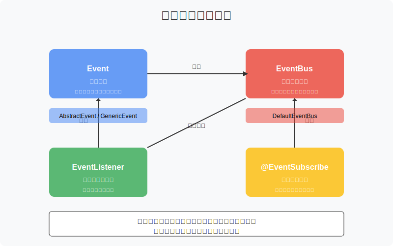
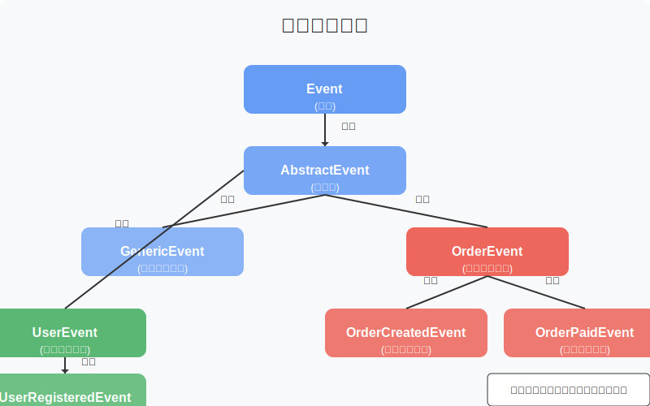
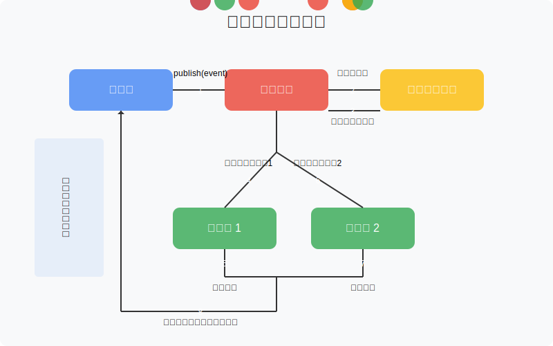
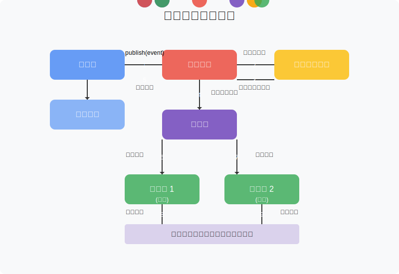

# 第2章：设计核心接口和事件模型

在第1章中，我们了解了事件驱动架构的基本概念和发布/订阅模式的工作原理。现在，我们将开始设计我们自己的事件驱动框架，首先从核心接口和事件模型开始。

## 2.1 框架整体架构设计

在开始编写代码之前，我们需要先设计框架的整体架构。一个良好的架构设计可以使框架更加灵活、可扩展，并且易于使用。

### 2.1.1 框架核心组件



我们的事件框架将包含以下核心组件：

1. **事件（Event）**：表示系统中发生的状态变化，包含事件ID、类型、数据等信息
2. **事件总线（EventBus）**：连接事件发布者和订阅者的中心组件
3. **事件监听器（EventListener）**：处理特定类型事件的组件
4. **事件注解（EventAnnotation）**：简化事件监听器的注册和使用

### 2.1.2 框架设计原则

在设计框架时，我们将遵循以下原则：

1. **接口分离原则**：将不同的功能分离到不同的接口中
2. **依赖倒置原则**：依赖于抽象而非具体实现
3. **单一职责原则**：每个组件只负责一项功能
4. **开闭原则**：对扩展开放，对修改关闭

## 2.2 设计事件接口

事件是框架的基础，它表示系统中发生的状态变化。我们需要设计一个通用的事件接口，以便不同类型的事件可以统一处理。

### 2.2.1 事件接口定义

```java
package com.example.event;

import java.util.Map;

/**
 * 事件接口
 * 所有事件必须实现此接口
 */
public interface Event {
    
    /**
     * 获取事件ID
     * @return 事件唯一标识符
     */
    String getId();
    
    /**
     * 获取事件类型
     * @return 事件类型
     */
    String getType();
    
    /**
     * 获取事件数据
     * @return 事件相关数据
     */
    Object getData();
    
    /**
     * 获取事件发生时间
     * @return 时间戳（毫秒）
     */
    long getTimestamp();
    
    /**
     * 获取事件元数据
     * @return 元数据Map
     */
    Map<String, Object> getMetadata();
}
```

### 2.2.2 抽象事件基类

为了简化事件的实现，我们可以提供一个抽象基类，实现事件接口的通用功能：

```java
package com.example.event;

import java.util.HashMap;
import java.util.Map;
import java.util.UUID;

/**
 * 抽象事件基类
 * 提供事件接口的基本实现
 */
public abstract class AbstractEvent implements Event {
    
    private final String id;
    private final long timestamp;
    private final Map<String, Object> metadata;
    
    /**
     * 构造函数
     */
    public AbstractEvent() {
        this.id = UUID.randomUUID().toString();
        this.timestamp = System.currentTimeMillis();
        this.metadata = new HashMap<>();
    }
    
    /**
     * 构造函数
     * @param metadata 事件元数据
     */
    public AbstractEvent(Map<String, Object> metadata) {
        this.id = UUID.randomUUID().toString();
        this.timestamp = System.currentTimeMillis();
        this.metadata = metadata != null ? metadata : new HashMap<>();
    }
    
    @Override
    public String getId() {
        return id;
    }
    
    @Override
    public long getTimestamp() {
        return timestamp;
    }
    
    @Override
    public Map<String, Object> getMetadata() {
        return metadata;
    }
    
    /**
     * 添加元数据
     * @param key 键
     * @param value 值
     */
    public void addMetadata(String key, Object value) {
        metadata.put(key, value);
    }
}
```

### 2.2.3 通用事件实现

接下来，我们可以提供一个通用的事件实现，用于简单场景：

```java
package com.example.event;

import java.util.Map;

/**
 * 通用事件实现
 * 适用于大多数简单场景
 */
public class GenericEvent extends AbstractEvent {
    
    private final String type;
    private final Object data;
    
    /**
     * 构造函数
     * @param type 事件类型
     * @param data 事件数据
     */
    public GenericEvent(String type, Object data) {
        super();
        this.type = type;
        this.data = data;
    }
    
    /**
     * 构造函数
     * @param type 事件类型
     * @param data 事件数据
     * @param metadata 事件元数据
     */
    public GenericEvent(String type, Object data, Map<String, Object> metadata) {
        super(metadata);
        this.type = type;
        this.data = data;
    }
    
    @Override
    public String getType() {
        return type;
    }
    
    @Override
    public Object getData() {
        return data;
    }
}
```

## 2.3 设计事件总线接口

事件总线是连接事件发布者和订阅者的中心组件，它负责事件的发布和分发。

### 2.3.1 事件总线接口定义

```java
package com.example.event;

/**
 * 事件总线接口
 * 负责事件的发布和订阅管理
 */
public interface EventBus {
    
    /**
     * 发布事件
     * @param event 要发布的事件
     */
    void publish(Event event);
    
    /**
     * 注册事件监听器
     * @param listener 事件监听器对象
     */
    void register(Object listener);
    
    /**
     * 注销事件监听器
     * @param listener 事件监听器对象
     */
    void unregister(Object listener);
    
    /**
     * 扫描并注册带有事件注解的监听器方法
     * @param target 目标对象
     */
    void scanAndRegister(Object target);
}
```

## 2.4 设计事件监听器接口

事件监听器负责处理特定类型的事件。我们可以通过接口或注解来定义事件监听器。

### 2.4.1 基于接口的事件监听器

```java
package com.example.event;

/**
 * 事件监听器接口
 * @param <T> 事件类型
 */
public interface EventListener<T extends Event> {
    
    /**
     * 处理事件
     * @param event 事件对象
     */
    void onEvent(T event);
    
    /**
     * 获取监听的事件类型
     * @return 事件类型字符串
     */
    String getEventType();
}
```

### 2.4.2 事件订阅注解

除了接口方式，我们还可以提供注解方式来定义事件监听器：

```java
package com.example.event;

import java.lang.annotation.Documented;
import java.lang.annotation.ElementType;
import java.lang.annotation.Retention;
import java.lang.annotation.RetentionPolicy;
import java.lang.annotation.Target;

/**
 * 事件订阅注解
 * 用于标记事件监听方法
 */
@Target(ElementType.METHOD)
@Retention(RetentionPolicy.RUNTIME)
@Documented
public @interface EventSubscribe {
    
    /**
     * 订阅的事件类型
     * 如果为空，则根据方法参数类型自动推断
     */
    String eventType() default "";
    
    /**
     * 是否异步处理事件
     */
    boolean async() default false;
}
```

## 2.5 事件模型设计

在设计事件模型时，我们需要考虑如何表示不同类型的事件，以及如何在事件之间建立关系。

### 2.5.1 事件类型设计

事件类型是区分不同事件的关键。我们可以采用以下几种方式来定义事件类型：

1. **字符串常量**：简单直观，但缺乏类型安全
2. **枚举类型**：类型安全，但不够灵活
3. **类名**：利用Java的类型系统，既安全又灵活

我们将采用第三种方式，使用类名作为事件类型，这样可以利用Java的类型系统来保证类型安全。

```java
package com.example.event;

/**
 * 事件类型工具类
 */
public class EventTypeResolver {
    
    /**
     * 从事件类获取事件类型
     * @param eventClass 事件类
     * @return 事件类型字符串
     */
    public static String resolveEventType(Class<? extends Event> eventClass) {
        return eventClass.getName();
    }
    
    /**
     * 从事件对象获取事件类型
     * @param event 事件对象
     * @return 事件类型字符串
     */
    public static String resolveEventType(Event event) {
        return event.getClass().getName();
    }
}
```

### 2.5.2 事件层次结构

我们可以通过继承来建立事件的层次结构，这样可以更好地组织和管理事件：



例如，我们可以定义一个订单相关事件的层次结构：

```java
package com.example.event.order;

import com.example.event.AbstractEvent;
import java.util.Map;

/**
 * 订单事件基类
 */
public abstract class OrderEvent extends AbstractEvent {
    
    private final String orderId;
    
    public OrderEvent(String orderId) {
        super();
        this.orderId = orderId;
    }
    
    public OrderEvent(String orderId, Map<String, Object> metadata) {
        super(metadata);
        this.orderId = orderId;
    }
    
    public String getOrderId() {
        return orderId;
    }
    
    @Override
    public String getType() {
        return this.getClass().getName();
    }
    
    @Override
    public Object getData() {
        return this;
    }
}

/**
 * 订单创建事件
 */
public class OrderCreatedEvent extends OrderEvent {
    
    private final double amount;
    private final String userId;
    
    public OrderCreatedEvent(String orderId, double amount, String userId) {
        super(orderId);
        this.amount = amount;
        this.userId = userId;
    }
    
    public double getAmount() {
        return amount;
    }
    
    public String getUserId() {
        return userId;
    }
}

/**
 * 订单支付事件
 */
public class OrderPaidEvent extends OrderEvent {
    
    private final String paymentId;
    private final double amount;
    
    public OrderPaidEvent(String orderId, String paymentId, double amount) {
        super(orderId);
        this.paymentId = paymentId;
        this.amount = amount;
    }
    
    public String getPaymentId() {
        return paymentId;
    }
    
    public double getAmount() {
        return amount;
    }
}
```

## 2.6 事件处理流程设计

在设计事件处理流程时，我们需要考虑同步和异步处理、错误处理等方面。

### 2.6.1 同步事件处理流程



同步事件处理流程如下：

1. 发布者调用`EventBus.publish(event)`方法发布事件
2. 事件总线查找订阅该事件类型的所有监听器
3. 事件总线按顺序调用每个监听器的处理方法
4. 所有监听器处理完成后，`publish`方法返回

### 2.6.2 异步事件处理流程



异步事件处理流程如下：

1. 发布者调用`EventBus.publish(event)`方法发布事件
2. 事件总线查找订阅该事件类型的所有监听器
3. 对于异步监听器，事件总线将事件处理任务提交到线程池
4. `publish`方法立即返回，不等待监听器处理完成
5. 线程池中的线程异步执行事件处理任务

### 2.6.3 错误处理设计

在事件处理过程中，可能会发生各种错误。我们需要设计合理的错误处理机制：

```java
package com.example.event;

/**
 * 事件处理异常
 */
public class EventProcessingException extends RuntimeException {
    
    private final Event event;
    
    public EventProcessingException(String message, Event event) {
        super(message);
        this.event = event;
    }
    
    public EventProcessingException(String message, Event event, Throwable cause) {
        super(message, cause);
        this.event = event;
    }
    
    public Event getEvent() {
        return event;
    }
}
```

```java
package com.example.event;

/**
 * 事件错误处理器接口
 */
public interface EventErrorHandler {
    
    /**
     * 处理事件处理过程中发生的错误
     * @param event 事件对象
     * @param listener 监听器对象
     * @param exception 异常对象
     */
    void handleError(Event event, Object listener, Exception exception);
}
```

## 2.7 小结

在本章中，我们设计了事件驱动框架的核心接口和事件模型，包括：

1. 事件接口及其实现
2. 事件总线接口
3. 事件监听器接口和注解
4. 事件类型和层次结构
5. 事件处理流程和错误处理

这些设计为我们实现一个功能完善的事件驱动框架奠定了基础。在下一章中，我们将开始实现基础事件总线，将这些接口和模型转化为可工作的代码。

## 练习

1. 尝试设计一个自定义事件类，继承`AbstractEvent`，并添加特定于业务的属性和方法
2. 思考如何设计一个事件过滤器，用于在事件分发前对事件进行过滤
3. 设计一个事件监听器优先级机制，使某些监听器可以优先处理事件