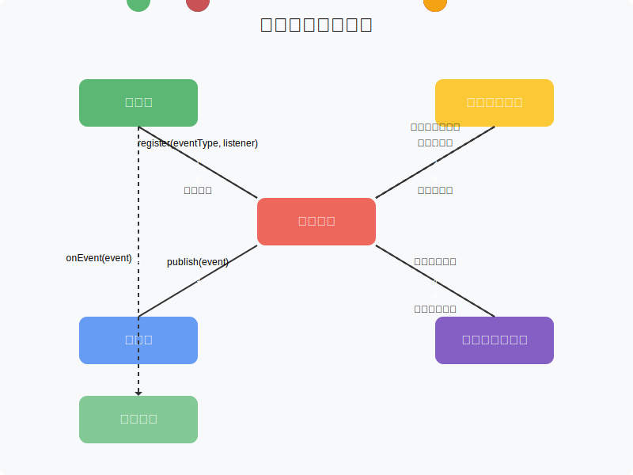

# 第3章：实现基础事件总线

在前两章中，我们已经了解了事件驱动框架的基础概念和设计了核心接口。本章将带领你实现一个基础的事件总线，这是事件框架的核心组件，负责事件的发布和分发。

## 3.1 事件总线的核心功能

事件总线是整个事件框架的中枢，它主要负责以下功能：

1. **监听器注册**：允许监听器注册到事件总线，以便在特定事件发生时被通知
2. **事件发布**：接收发布者发布的事件，并将其分发给相应的监听器
3. **监听器查找**：根据事件类型查找对应的监听器
4. **事件分发**：将事件分发给对应的监听器进行处理

下面我们将逐步实现这些功能。

## 3.2 实现基础事件总线

首先，让我们创建一个基础的事件总线实现类 `DefaultEventBus`，它实现了我们在第2章中设计的 `EventBus` 接口。

```java
public class DefaultEventBus implements EventBus {
    // 监听器注册表，用于存储事件类型与对应的监听器列表
    private final Map<String, List<EventListener>> listenerRegistry = new ConcurrentHashMap<>();
    
    // 事件类型解析器，用于解析事件的类型
    private final EventTypeResolver eventTypeResolver;
    
    public DefaultEventBus() {
        this(new DefaultEventTypeResolver());
    }
    
    public DefaultEventBus(EventTypeResolver eventTypeResolver) {
        this.eventTypeResolver = eventTypeResolver;
    }
    
    @Override
    public void publish(Event event) {
        // 获取事件类型
        String eventType = eventTypeResolver.resolveEventType(event);
        
        // 查找对应的监听器列表
        List<EventListener> listeners = listenerRegistry.getOrDefault(eventType, Collections.emptyList());
        
        // 分发事件给所有监听器
        for (EventListener listener : listeners) {
            try {
                listener.onEvent(event);
            } catch (Exception e) {
                // 处理异常，这里简单打印日志，实际应用中可能需要更复杂的错误处理
                System.err.println("Error handling event " + eventType + " by listener " + listener + ": " + e.getMessage());
            }
        }
    }
    
    @Override
    public void register(String eventType, EventListener listener) {
        // 获取或创建监听器列表
        List<EventListener> listeners = listenerRegistry.computeIfAbsent(eventType, k -> new CopyOnWriteArrayList<>());
        
        // 添加监听器到列表中
        listeners.add(listener);
    }
    
    @Override
    public void unregister(String eventType, EventListener listener) {
        // 获取监听器列表
        List<EventListener> listeners = listenerRegistry.get(eventType);
        
        // 如果列表存在，则移除监听器
        if (listeners != null) {
            listeners.remove(listener);
            
            // 如果列表为空，则从注册表中移除该事件类型
            if (listeners.isEmpty()) {
                listenerRegistry.remove(eventType);
            }
        }
    }
}
```

上面的代码实现了一个基础的事件总线，它使用 `ConcurrentHashMap` 作为监听器注册表，以确保线程安全。同时，我们使用 `CopyOnWriteArrayList` 来存储监听器列表，这样在遍历列表时不会出现并发修改异常。

## 3.3 事件类型解析器

在上面的代码中，我们使用了 `EventTypeResolver` 接口来解析事件的类型。现在让我们实现这个接口：

```java
public interface EventTypeResolver {
    /**
     * 解析事件的类型
     * 
     * @param event 事件对象
     * @return 事件类型的字符串表示
     */
    String resolveEventType(Event event);
}

public class DefaultEventTypeResolver implements EventTypeResolver {
    @Override
    public String resolveEventType(Event event) {
        // 首先尝试从事件对象获取类型
        String eventType = event.getType();
        
        // 如果事件对象没有提供类型，则使用事件类的全限定名作为类型
        if (eventType == null || eventType.isEmpty()) {
            eventType = event.getClass().getName();
        }
        
        return eventType;
    }
}
```

这个实现首先尝试从事件对象获取类型，如果事件对象没有提供类型，则使用事件类的全限定名作为类型。这样可以确保每种事件类型都有一个唯一的标识符。

## 3.4 异步事件总线

在实际应用中，我们可能需要异步处理事件，以避免阻塞发布者线程。下面我们将实现一个异步事件总线：

```java
public class AsyncEventBus extends DefaultEventBus {
    private final ExecutorService executorService;
    
    public AsyncEventBus(int threadPoolSize) {
        this(Executors.newFixedThreadPool(threadPoolSize));
    }
    
    public AsyncEventBus(ExecutorService executorService) {
        super();
        this.executorService = executorService;
    }
    
    @Override
    public void publish(Event event) {
        // 获取事件类型
        String eventType = getEventTypeResolver().resolveEventType(event);
        
        // 查找对应的监听器列表
        List<EventListener> listeners = getListenerRegistry().getOrDefault(eventType, Collections.emptyList());
        
        // 异步分发事件给所有监听器
        for (EventListener listener : listeners) {
            executorService.submit(() -> {
                try {
                    listener.onEvent(event);
                } catch (Exception e) {
                    // 处理异常
                    System.err.println("Error handling event " + eventType + " by listener " + listener + ": " + e.getMessage());
                }
            });
        }
    }
    
    // 获取事件类型解析器的方法，需要在DefaultEventBus中添加对应的getter
    protected EventTypeResolver getEventTypeResolver() {
        return eventTypeResolver;
    }
    
    // 获取监听器注册表的方法，需要在DefaultEventBus中添加对应的getter
    protected Map<String, List<EventListener>> getListenerRegistry() {
        return listenerRegistry;
    }
    
    // 关闭线程池的方法
    public void shutdown() {
        executorService.shutdown();
    }
}
```

在这个实现中，我们使用线程池来异步处理事件，这样可以避免为每个事件创建一个新线程，提高性能。

## 3.5 事件总线工厂

为了方便创建不同类型的事件总线，我们可以实现一个事件总线工厂：

```java
public class EventBusFactory {
    private static EventBus defaultEventBus;
    private static EventBus asyncEventBus;
    
    /**
     * 获取默认的同步事件总线实例
     */
    public static synchronized EventBus getDefaultEventBus() {
        if (defaultEventBus == null) {
            defaultEventBus = new DefaultEventBus();
        }
        return defaultEventBus;
    }
    
    /**
     * 获取异步事件总线实例
     */
    public static synchronized EventBus getAsyncEventBus() {
        if (asyncEventBus == null) {
            // 使用处理器核心数作为线程池大小
            int threadPoolSize = Runtime.getRuntime().availableProcessors();
            asyncEventBus = new AsyncEventBus(threadPoolSize);
        }
        return asyncEventBus;
    }
    
    /**
     * 创建一个新的同步事件总线
     */
    public static EventBus createSyncEventBus() {
        return new DefaultEventBus();
    }
    
    /**
     * 创建一个新的异步事件总线，使用指定大小的线程池
     */
    public static EventBus createAsyncEventBus(int threadPoolSize) {
        return new AsyncEventBus(threadPoolSize);
    }
    
    /**
     * 创建一个新的异步事件总线，使用指定的线程池
     */
    public static EventBus createAsyncEventBus(ExecutorService executorService) {
        return new AsyncEventBus(executorService);
    }
}
```

这个工厂类提供了获取单例事件总线和创建新事件总线的方法，方便在不同场景下使用不同类型的事件总线。

## 3.6 事件总线的使用示例

下面是一个使用事件总线的简单示例：

```java
// 创建事件类
public class OrderCreatedEvent implements Event {
    private final String orderId;
    private final double amount;
    private final long timestamp;
    
    public OrderCreatedEvent(String orderId, double amount) {
        this.orderId = orderId;
        this.amount = amount;
        this.timestamp = System.currentTimeMillis();
    }
    
    @Override
    public String getId() {
        return orderId;
    }
    
    @Override
    public String getType() {
        return "ORDER_CREATED";
    }
    
    @Override
    public Object getData() {
        Map<String, Object> data = new HashMap<>();
        data.put("orderId", orderId);
        data.put("amount", amount);
        return data;
    }
    
    @Override
    public long getTimestamp() {
        return timestamp;
    }
    
    @Override
    public Map<String, Object> getMetadata() {
        return Collections.emptyMap();
    }
    
    // Getter方法
    public String getOrderId() {
        return orderId;
    }
    
    public double getAmount() {
        return amount;
    }
}

// 创建事件监听器
public class OrderCreatedListener implements EventListener {
    @Override
    public void onEvent(Event event) {
        if (event instanceof OrderCreatedEvent) {
            OrderCreatedEvent orderEvent = (OrderCreatedEvent) event;
            System.out.println("Order created: " + orderEvent.getOrderId() + ", amount: " + orderEvent.getAmount());
            // 处理订单创建逻辑...
        }
    }
}

// 使用事件总线
public class EventBusDemo {
    public static void main(String[] args) {
        // 获取默认事件总线
        EventBus eventBus = EventBusFactory.getDefaultEventBus();
        
        // 创建并注册监听器
        EventListener orderListener = new OrderCreatedListener();
        eventBus.register("ORDER_CREATED", orderListener);
        
        // 创建并发布事件
        Event orderEvent = new OrderCreatedEvent("ORD-001", 99.99);
        eventBus.publish(orderEvent);
        
        // 使用异步事件总线
        EventBus asyncEventBus = EventBusFactory.getAsyncEventBus();
        asyncEventBus.register("ORDER_CREATED", orderListener);
        asyncEventBus.publish(orderEvent);
        
        // 如果使用的是异步事件总线，需要等待一段时间让异步任务完成
        try {
            Thread.sleep(1000);
        } catch (InterruptedException e) {
            e.printStackTrace();
        }
        
        // 关闭异步事件总线的线程池
        if (asyncEventBus instanceof AsyncEventBus) {
            ((AsyncEventBus) asyncEventBus).shutdown();
        }
    }
}
```

## 3.7 事件总线的工作流程



事件总线的工作流程如下：

1. **监听器注册**：监听器通过 `register` 方法注册到事件总线，指定感兴趣的事件类型
2. **事件发布**：发布者通过 `publish` 方法发布事件到事件总线
3. **事件类型解析**：事件总线使用 `EventTypeResolver` 解析事件的类型
4. **监听器查找**：事件总线根据事件类型查找对应的监听器列表
5. **事件分发**：事件总线将事件分发给所有匹配的监听器
6. **事件处理**：监听器接收事件并进行处理

## 3.8 同步与异步事件处理的比较

| 特性 | 同步事件总线 | 异步事件总线 |
|------|------------|-------------|
| 执行方式 | 在发布者线程中执行 | 在线程池的线程中执行 |
| 发布者阻塞 | 发布者线程会被阻塞直到所有监听器处理完成 | 发布者线程不会被阻塞 |
| 事件顺序 | 保证按照发布顺序处理 | 不保证按照发布顺序处理 |
| 错误传播 | 错误会传播到发布者 | 错误不会传播到发布者 |
| 适用场景 | 需要立即响应的场景，如事务处理 | 不需要立即响应的场景，如日志记录、统计分析 |

## 3.9 小结

在本章中，我们实现了一个基础的事件总线，包括同步和异步两种实现方式。事件总线是事件框架的核心组件，负责事件的发布和分发。通过事件总线，我们可以实现组件之间的松耦合，提高系统的可扩展性和可维护性。

在下一章中，我们将介绍如何使用注解来简化事件监听器的注册过程，使事件框架更加易用。

## 练习

1. 尝试扩展 `DefaultEventBus`，添加对事件优先级的支持，使高优先级的监听器先于低优先级的监听器处理事件。
2. 实现一个 `FilteredEventBus`，允许在发布事件前对事件进行过滤，只有通过过滤的事件才会被分发给监听器。
3. 修改 `AsyncEventBus`，使其支持按照事件类型使用不同的线程池，以便为不同类型的事件提供不同的处理策略。
4. 实现一个事件监控功能，记录每个事件的处理时间和结果，以便进行性能分析和问题排查。