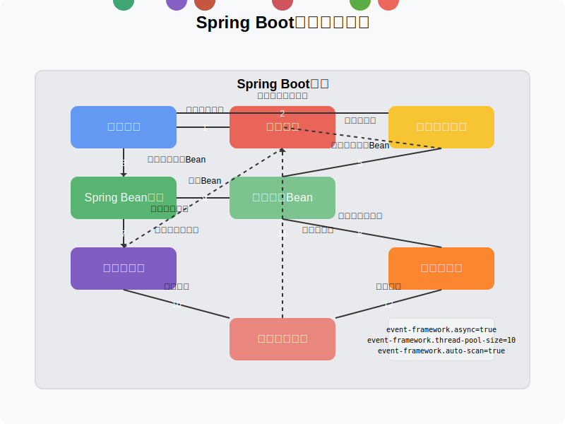

# 第5章：实现Spring Boot集成

在前面的章节中，我们已经实现了一个功能完整的事件框架，包括事件总线、事件监听器和注解支持。然而，在实际应用中，我们通常会使用Spring Boot等框架来构建应用。本章将介绍如何将我们的事件框架与Spring Boot集成，使其更加易用和强大。

## 5.1 Spring Boot集成的优势

将事件框架与Spring Boot集成有以下几个优势：

1. **自动配置**：利用Spring Boot的自动配置机制，自动创建和配置事件总线。
2. **依赖注入**：利用Spring的依赖注入机制，自动注入事件总线和其他组件。
3. **组件扫描**：利用Spring的组件扫描机制，自动发现和注册带有注解的事件监听器。
4. **生命周期管理**：利用Spring的生命周期管理机制，管理事件总线和监听器的生命周期。
5. **与Spring事件的集成**：可以与Spring的事件机制集成，实现更加强大的事件处理能力。

## 5.2 创建Spring Boot Starter

为了方便使用，我们将创建一个Spring Boot Starter，用于自动配置事件框架。首先，我们需要创建一个新的Maven项目，并添加以下依赖：

```xml
<dependencies>
    <!-- Spring Boot Starter -->
    <dependency>
        <groupId>org.springframework.boot</groupId>
        <artifactId>spring-boot-starter</artifactId>
    </dependency>
    
    <!-- Spring Boot AutoConfigure -->
    <dependency>
        <groupId>org.springframework.boot</groupId>
        <artifactId>spring-boot-autoconfigure</artifactId>
    </dependency>
    
    <!-- 我们的事件框架 -->
    <dependency>
        <groupId>com.example</groupId>
        <artifactId>event-framework</artifactId>
        <version>1.0.0</version>
    </dependency>
</dependencies>
```

## 5.3 创建自动配置类

接下来，我们需要创建一个自动配置类，用于自动创建和配置事件总线：

```java
package com.example.eventframework.spring;

import com.example.eventframework.EventBus;
import com.example.eventframework.DefaultEventBus;
import com.example.eventframework.AsyncEventBus;
import org.springframework.boot.autoconfigure.condition.ConditionalOnMissingBean;
import org.springframework.boot.autoconfigure.condition.ConditionalOnProperty;
import org.springframework.boot.context.properties.EnableConfigurationProperties;
import org.springframework.context.annotation.Bean;
import org.springframework.context.annotation.Configuration;

import java.util.concurrent.Executors;

@Configuration
@EnableConfigurationProperties(EventFrameworkProperties.class)
public class EventFrameworkAutoConfiguration {
    
    private final EventFrameworkProperties properties;
    
    public EventFrameworkAutoConfiguration(EventFrameworkProperties properties) {
        this.properties = properties;
    }
    
    /**
     * 创建默认的事件总线
     */
    @Bean
    @ConditionalOnMissingBean
    @ConditionalOnProperty(name = "event-framework.async", havingValue = "false", matchIfMissing = true)
    public EventBus eventBus() {
        return new DefaultEventBus();
    }
    
    /**
     * 创建异步事件总线
     */
    @Bean
    @ConditionalOnMissingBean
    @ConditionalOnProperty(name = "event-framework.async", havingValue = "true")
    public EventBus asyncEventBus() {
        int threadPoolSize = properties.getThreadPoolSize();
        return new AsyncEventBus(Executors.newFixedThreadPool(threadPoolSize));
    }
}
```

这个自动配置类使用了Spring Boot的条件注解，根据配置属性创建同步或异步事件总线。

## 5.4 创建配置属性类

为了支持自定义配置，我们需要创建一个配置属性类：

```java
package com.example.eventframework.spring;

import org.springframework.boot.context.properties.ConfigurationProperties;

@ConfigurationProperties(prefix = "event-framework")
public class EventFrameworkProperties {
    
    /**
     * 是否使用异步事件总线
     */
    private boolean async = false;
    
    /**
     * 异步事件总线的线程池大小
     */
    private int threadPoolSize = Runtime.getRuntime().availableProcessors();
    
    /**
     * 是否自动扫描带有注解的监听器
     */
    private boolean autoScan = true;
    
    // Getter和Setter方法
    public boolean isAsync() {
        return async;
    }
    
    public void setAsync(boolean async) {
        this.async = async;
    }
    
    public int getThreadPoolSize() {
        return threadPoolSize;
    }
    
    public void setThreadPoolSize(int threadPoolSize) {
        this.threadPoolSize = threadPoolSize;
    }
    
    public boolean isAutoScan() {
        return autoScan;
    }
    
    public void setAutoScan(boolean autoScan) {
        this.autoScan = autoScan;
    }
}
```

这个配置属性类定义了事件框架的配置选项，包括是否使用异步事件总线、线程池大小和是否自动扫描带有注解的监听器。

## 5.5 创建事件监听器注册器

为了自动扫描和注册带有 `@EventSubscribe` 注解的方法，我们需要创建一个事件监听器注册器：

```java
package com.example.eventframework.spring;

import com.example.eventframework.EventBus;
import org.springframework.beans.BeansException;
import org.springframework.beans.factory.config.BeanPostProcessor;
import org.springframework.context.ApplicationContext;
import org.springframework.context.ApplicationContextAware;

public class EventListenerRegistrar implements BeanPostProcessor, ApplicationContextAware {
    
    private final EventBus eventBus;
    private final EventFrameworkProperties properties;
    private ApplicationContext applicationContext;
    
    public EventListenerRegistrar(EventBus eventBus, EventFrameworkProperties properties) {
        this.eventBus = eventBus;
        this.properties = properties;
    }
    
    @Override
    public void setApplicationContext(ApplicationContext applicationContext) throws BeansException {
        this.applicationContext = applicationContext;
    }
    
    @Override
    public Object postProcessAfterInitialization(Object bean, String beanName) throws BeansException {
        // 如果启用了自动扫描，则扫描带有注解的方法
        if (properties.isAutoScan()) {
            eventBus.scanAndRegister(bean);
        }
        return bean;
    }
}
```

这个注册器实现了 `BeanPostProcessor` 接口，在每个Bean初始化后，扫描其中带有 `@EventSubscribe` 注解的方法，并注册到事件总线。

## 5.6 注册事件监听器注册器

接下来，我们需要在自动配置类中注册事件监听器注册器：

```java
@Configuration
@EnableConfigurationProperties(EventFrameworkProperties.class)
public class EventFrameworkAutoConfiguration {
    
    // 前面的代码...
    
    /**
     * 创建事件监听器注册器
     */
    @Bean
    @ConditionalOnProperty(name = "event-framework.auto-scan", havingValue = "true", matchIfMissing = true)
    public EventListenerRegistrar eventListenerRegistrar(EventBus eventBus) {
        return new EventListenerRegistrar(eventBus, properties);
    }
}
```

## 5.7 创建Spring Boot Starter的元数据

为了让Spring Boot能够自动发现我们的自动配置类，我们需要创建一个 `spring.factories` 文件，放在 `META-INF` 目录下：

```
org.springframework.boot.autoconfigure.EnableAutoConfiguration=\
com.example.eventframework.spring.EventFrameworkAutoConfiguration
```

这个文件告诉Spring Boot，当启用自动配置时，应该加载我们的自动配置类。

## 5.8 使用Spring Boot Starter

现在，我们可以在Spring Boot应用中使用我们的事件框架了。首先，添加依赖：

```xml
<dependency>
    <groupId>com.example</groupId>
    <artifactId>event-framework-spring-boot-starter</artifactId>
    <version>1.0.0</version>
</dependency>
```

然后，在 `application.properties` 或 `application.yml` 中配置事件框架：

```properties
# 使用异步事件总线
event-framework.async=true
# 设置线程池大小
event-framework.thread-pool-size=10
# 启用自动扫描
event-framework.auto-scan=true
```

最后，在Spring Boot应用中使用事件框架：

```java
@Service
public class OrderService {
    
    private final EventBus eventBus;
    
    @Autowired
    public OrderService(EventBus eventBus) {
        this.eventBus = eventBus;
    }
    
    public void createOrder(String orderId, double amount) {
        // 创建订单逻辑...
        
        // 发布事件
        Event event = new OrderCreatedEvent(orderId, amount);
        eventBus.publish(event);
    }
    
    @EventSubscribe(eventType = "ORDER_CREATED")
    public void handleOrderCreated(OrderCreatedEvent event) {
        System.out.println("Order created: " + event.getOrderId() + ", amount: " + event.getAmount());
        // 处理订单创建逻辑...
    }
}
```

在这个示例中，我们注入了事件总线，并使用它发布事件。同时，我们使用 `@EventSubscribe` 注解定义了一个事件监听方法，它会被自动注册到事件总线。

## 5.9 与Spring事件的集成

除了自己的事件框架，我们还可以与Spring的事件机制集成，实现更加强大的事件处理能力。

### 5.9.1 将Spring事件转发到我们的事件框架

```java
@Component
public class SpringEventBridge implements ApplicationListener<ApplicationEvent> {
    
    private final EventBus eventBus;
    
    @Autowired
    public SpringEventBridge(EventBus eventBus) {
        this.eventBus = eventBus;
    }
    
    @Override
    public void onApplicationEvent(ApplicationEvent event) {
        // 将Spring事件包装为我们的事件
        Event wrappedEvent = new SpringEventWrapper(event);
        // 发布到我们的事件总线
        eventBus.publish(wrappedEvent);
    }
    
    /**
     * Spring事件包装类
     */
    private static class SpringEventWrapper implements Event {
        private final ApplicationEvent springEvent;
        private final String id;
        
        public SpringEventWrapper(ApplicationEvent springEvent) {
            this.springEvent = springEvent;
            this.id = UUID.randomUUID().toString();
        }
        
        @Override
        public String getId() {
            return id;
        }
        
        @Override
        public String getType() {
            return "SPRING_EVENT_" + springEvent.getClass().getSimpleName();
        }
        
        @Override
        public Object getData() {
            return springEvent;
        }
        
        @Override
        public long getTimestamp() {
            return springEvent.getTimestamp();
        }
        
        @Override
        public Map<String, Object> getMetadata() {
            Map<String, Object> metadata = new HashMap<>();
            metadata.put("springEventClass", springEvent.getClass().getName());
            return metadata;
        }
    }
}
```

这个组件实现了Spring的 `ApplicationListener` 接口，监听所有Spring事件，并将其转发到我们的事件总线。

### 5.9.2 将我们的事件转发到Spring事件

```java
@Component
public class EventBusBridge implements EventListener {
    
    private final ApplicationEventPublisher eventPublisher;
    
    @Autowired
    public EventBusBridge(ApplicationEventPublisher eventPublisher, EventBus eventBus) {
        this.eventPublisher = eventPublisher;
        // 注册到事件总线，监听所有事件
        eventBus.register("*", this);
    }
    
    @Override
    public void onEvent(Event event) {
        // 将我们的事件包装为Spring事件
        ApplicationEvent springEvent = new EventWrapper(event);
        // 发布到Spring事件发布器
        eventPublisher.publishEvent(springEvent);
    }
    
    /**
     * 事件包装类
     */
    private static class EventWrapper extends ApplicationEvent {
        private final Event event;
        
        public EventWrapper(Event event) {
            super(event);
            this.event = event;
        }
        
        public Event getEvent() {
            return event;
        }
    }
}
```

这个组件实现了我们的 `EventListener` 接口，监听所有事件，并将其转发到Spring的事件发布器。

## 5.10 Spring Boot集成的工作流程



Spring Boot集成的工作流程如下：

1. **自动配置**：Spring Boot启动时，自动配置事件框架，创建事件总线和其他组件。
2. **Bean初始化**：Spring创建和初始化所有Bean。
3. **监听器注册**：事件监听器注册器扫描所有Bean，查找带有 `@EventSubscribe` 注解的方法，并注册到事件总线。
4. **事件发布**：应用代码通过注入的事件总线发布事件。
5. **事件处理**：事件总线将事件分发给已注册的监听器进行处理。

## 5.11 小结

在本章中，我们介绍了如何将事件框架与Spring Boot集成，使其更加易用和强大。我们创建了一个Spring Boot Starter，实现了自动配置、依赖注入、组件扫描和生命周期管理，并与Spring的事件机制集成。

通过这些集成，我们可以在Spring Boot应用中更加方便地使用事件框架，利用Spring的强大功能，实现更加灵活和可扩展的事件处理机制。

在下一章中，我们将介绍事件框架的高级特性和性能优化，使其更加强大和高效。

## 练习

1. 扩展自动配置类，支持更多的配置选项，如事件过滤器、事件监控等。
2. 实现一个Spring Boot Actuator端点，用于监控事件总线的状态和性能。
3. 实现一个Spring Boot Admin集成，用于可视化事件流和监控事件处理性能。
4. 扩展事件框架，支持Spring Cloud Stream，实现分布式事件处理。